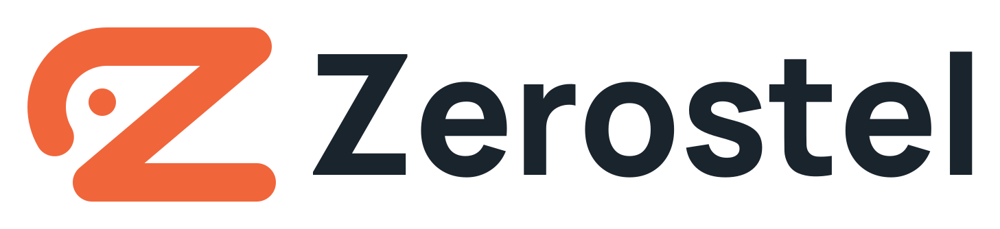
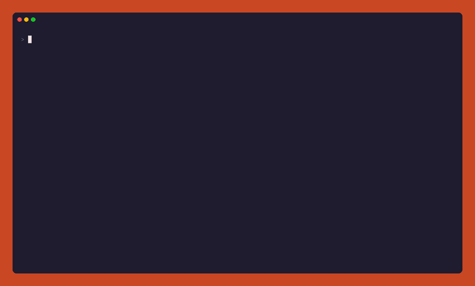

<div align="center">

<picture>
  <source media="(prefers-color-scheme: dark)" srcset="docs/assets/brand/zerostel-logo-dark.svg">
  
</picture>

**Rewind any AI agent to point zero.**

Zero trust for AI agents: assume they'll break something, record every step, and rewind the files they touched.
A flight recorder and time machine for coding agents: every step on record, tests tied to the code they ran on, guardrails you set, and a handoff the next agent or person can check.

[Website](https://zerostel.com) · [English](README.md) · [繁體中文](README.zh-TW.md) · [简体中文](README.zh-CN.md) · [日本語](README.ja.md)

[](https://www.npmjs.com/package/zerostel)
[](https://github.com/zerostel/zerostel/actions/workflows/ci.yml)


</div>

<p align="center"></p>

## Quick start

```bash
npx zerostel install
```

Want to see it first? `npx zerostel demo` makes a throwaway project, plays one agent turn that deletes a folder and breaks the tests, and lets you undo it. No agent needed, and none of your projects are touched.

Then use your agent as usual. When it breaks something:

```bash
zerostel log          # what happened, step by step
zerostel checks       # did the tests pass on the code as it is now?
zerostel undo         # put the files back to before the agent's last turn
zerostel rewind 0     # or all the way back to point zero, where the session started
zerostel handoff      # what the next agent or person needs to carry on
zerostel ui           # the same, clickable, in a local web page
```

## What it does

- **Record.** Every prompt, tool call, command, file change, duration and token count, in one timeline per session: `zerostel log` in the terminal, or `zerostel ui` in a local web page.
- **Rewind.** A snapshot before and after every tool call that can change files, shell commands included. Undo a turn, go back to any step, or all the way to point zero; every rewind can itself be undone.
- **Guard.** Your own rules block a tool call, or make the agent ask you first, before it runs. The same rules for every agent.
- **Check and hand over.** Every test, type check and build the agent runs is tied to the code it ran on, so `zerostel checks` tells a pass on today's code from one on code that has changed since. `zerostel handoff` gives the next agent or person your asks, where things stand and what was tried.
- **Verify and share.** A hash-chained log that shows if it was edited, and a one-page report with a privacy mode for sharing.
- **Stay local.** Nothing is uploaded, `~/.zerostel` is readable only by you, and your `.git` is never touched.

It's zero trust for AI agents: assume one can go wrong, see everything it does, and keep a way back ([in practice](docs/zero-trust.md)). It isn't a sandbox: network requests, deployments and database writes can't be taken back. See [Limits](#limits).

## Why

Agents edit dozens of files, run `rm`, `git checkout .`, migrations and build scripts. When something goes wrong you're left asking what it did and how to get back.

Some agents have checkpoints of their own, and they differ a lot. Claude Code's rewind skips changes made through Bash. Copilot CLI tracks shell commands. Cursor and Codex each have their own model. If you use more than one agent, you get a different answer to "what changed and can I get it back" in each.

Zerostel records every supported agent the same way: a snapshot of the project around each tool call that can change files, a timeline of prompts, commands, files, time and tokens, and a report you can hand to someone else. It never touches your `.git`.

| | Agent's own checkpoints | Commits / `git stash` | **Zerostel** |
|---|---|---|---|
| Changes made by shell commands | depends on the agent | only what you committed or stashed | ✅ inside the project, plus files you list |
| Go back to a specific step | usually per prompt | per commit or stash | ✅ per tool call |
| Timeline of commands, files, tokens, time | partial | ❌ | ✅ |
| Log that shows if it was edited afterwards | ❌ | ✅ (commit hashes) | ✅ |
| Your own rules: block or ask before a tool runs | per agent | ❌ | ✅ same rules for every agent |
| Same behaviour across agents | ❌ one each | ✅ | ✅ |
| Writes to your `.git` | some do | ✅ | ❌ never |
| Shareable report of the session | ❌ | ❌ | ✅ |

Details and sources: [docs/comparison.md](docs/comparison.md). The story behind it, with the incidents: [What your coding agent's checkpoints can't bring back](https://zerostel.com/blog/agent-checkpoints/).

## Compared with other tools

Agents keep adding checkpoints of their own, and there are good add-ons too: [Turnback](https://github.com/MFaizR77/turnback), [Turnal](https://github.com/AadiJo/turnal), [bashback](https://github.com/trouties/bashback), [logbook](https://github.com/sheeki03/logbook), [codex-rewind](https://github.com/extracurricular-ai/codex-rewind). What Zerostel adds:

- **Rewinds that don't lose work.** Nothing is deleted or overwritten without an exact copy, each file is looked at again right before it changes, `--keep-others` keeps what another agent or you changed since, and every rewind, even one cut short, can be undone.
- **More than the project folder.** Watched files like `~/.zshrc`, Windows user environment variables, and global installs (listed, with the commands that undo them).
- **Evidence tied to the code.** Tests and builds are recorded against the exact code they ran on, so a pass on code that has changed since shows as out of date, and a handoff can be checked against the folder.
- **One set of rules for every agent.** Guardrails that block or ask before a tool runs, and a log that shows if it was edited.
- **Your agents as they are.** Hooks into the official agents, no fork or wrapper; zero runtime dependencies, nothing sent anywhere.

Something else can fit better: the agents' own `/rewind` and codex-rewind bring the conversation back with the files, and Turnal can bisect the turn that broke the tests. [Each tool side by side, with sources](docs/alternatives.md).

## Supported agents and systems

| Agent | How | Status |
|---|---|---|
| Claude Code | hooks | ✅ tested on real sessions |
| Codex | hooks (approve once with `/hooks`) | ✅ tested on real sessions |
| Cursor | hooks | ✅ CLI tested on real sessions; the CLI sends no prompt events, so undo goes one change at a time there. On Windows, start it from PowerShell: from Git Bash its hooks don't run |
| Gemini CLI | hooks (trusted folders only) | ✅ tested end to end¹; for Code Assist Standard/Enterprise and paid API keys, since personal accounts moved to Antigravity in June 2026 |
| Antigravity (CLI, desktop, IDE) | hooks | ✅ tested end to end¹; it doesn't pass on the prompt text, so turns show as "New turn" |
| Copilot CLI | hooks (`~/.copilot/hooks`) | ✅ tested on real sessions |
| opencode | plugin | ✅ tested on real sessions |
| DeepSeek Harness | plugin | 🧪 experimental (dsh itself is a developer preview); tested end to end¹ |
| anything else (Aider, scripts…) | `zerostel run -- <command>` watches the files | ✅ coarser: no tool calls, tokens or guardrails |

¹ The real agent on Windows, with its model swapped for a scripted one: a prompt, a file write, a command, a call blocked by a rule, the end of the turn and an undo.

Experimental agents are installed only when you name them: `zerostel install --agent deepseek`. Reports from real sessions are welcome.

Agents don't all report the same things to their hooks (prompts, failed commands, tokens); [what each one tells Zerostel](docs/install.md#what-each-agent-tells-zerostel).

Zerostel doesn't care which model is behind the agent: Claude, GPT, Gemini, DeepSeek or a local one are all recorded the same way.

Windows, macOS and Linux (WSL too). CI runs every commit on all three with Node 20, 22 and 24.

## Install

```bash
npx zerostel install          # one-off, nothing installed globally
npm install -g zerostel       # or keep the `zerostel` command around
```

You need git, and Node 20 or newer. No Node? Every release has a single executable with Node inside for Windows, macOS and Linux: download it from [Releases](https://github.com/zerostel/zerostel/releases) and run `zerostel install`. Plugins for Claude Code, Codex, Antigravity and Gemini CLI, the agent skill, and how to check a download: [docs/install.md](docs/install.md).

## Documentation

| | |
|---|---|
| [Commands](docs/commands.md) | every command and option |
| [Guardrails](docs/guardrails.md) | how rules work, and tested recipes |
| [Configuration](docs/configuration.md) | `~/.zerostel/config.json` |
| [CI](docs/ci.md) | the GitHub Action |
| [MCP server](docs/mcp.md) | let the agent read its timeline and rewind when you ask |
| [How it works](docs/architecture.md) | hooks, the shadow repo, safe rewinds, the audit chain |
| [Zero trust](docs/zero-trust.md) | each principle, and what Zerostel does for it |
| [Security model](docs/security-model.md) | what it protects and what it doesn't |
| [Agents' own checkpoints](docs/comparison.md) | what each agent's undo brings back, with sources |
| [Other tools](docs/alternatives.md) | Turnback, Turnal, bashback and others, side by side |
| [FAQ](docs/faq.md) | speed, disk use, git, jj, sandboxes, tokens |

Something not working? Run `zerostel doctor`: it checks Node, git, each agent's hooks, your config and guardrails, and its output is safe to paste into an issue.

## Limits

- Only states that were captured can be restored. Recording that starts after a deletion can't bring the file back.
- Inside one shell command there are no intermediate states: a file created and deleted by the same command is never seen. `zerostel run` snapshots when files settle, so it can miss short-lived files too.
- Outside the project, only files you list under `watch` are snapshotted, and only files under your home folder. On Windows, user environment variables (`HKCU\Environment`) are read around commands that change them and put back by rewinds; their values are kept in the session log on your machine, never in reports. Global packages are only listed, with the commands to undo them. Rewinds leave alone watched files that didn't exist at the target point. Everything else outside the project isn't covered; the timeline still shows the command that touched it.
- Not snapshotted, and listed by `zerostel log` when present: ignored folders (`node_modules`, `dist/`, anything in `.gitignore`), nested git repositories and submodules, linked folders (symlinks, junctions) and new files above `maxFileMB`.
- Agents started in your home directory, a drive root or a folder above your home folder get a timeline but no snapshots.
- A rewind puts back whole files: with `--keep-others` it leaves files someone else changed, but it doesn't merge edits two agents made to the same file.
- A test or build the agent ran counts as passed only when the agent reports the result; `zerostel check -- <command>` always knows.
- On case-insensitive file systems (Windows, macOS by default) a rename that only changes case, such as `readme.md` → `README.md`, isn't seen as a change.
- Under WSL, projects on the Windows drive (`/mnt/c/...`) are slow to snapshot. Keep them in the Linux file system.
- The audit chain shows a log was edited by anything that doesn't have your `audit.key`. Someone using your own account can read the key and rewrite a log completely; keep `~/.zerostel/**` in a deny rule so the agent can't.
- Guardrails match what a tool call names. A script or command that reaches a file without naming it gets through.

## Roadmap

- **Done:** recording and rewinding seven agents, point zero, web UI, shareable reports, verifiable logs, guardrails, MCP server, watched files outside the project, checks tied to the code they ran on, handoffs, rewinds that keep other sessions' work.
- **Next:** signed reports anyone can verify without your key; recording calls to other MCP servers through a Zerostel gateway; finding the step that broke a check, and which test broke; real-session validation of the experimental agents.
- **Help wanted:** [test reports from macOS and Linux](https://github.com/zerostel/zerostel/issues/4), and anything labeled [help wanted](https://github.com/zerostel/zerostel/issues?q=is%3Aissue+is%3Aopen+label%3A%22help+wanted%22).

## Contributing

Questions and ideas are welcome in [Discussions](https://github.com/zerostel/zerostel/discussions). Supporting a new agent means adding one adapter to [src/agents/adapters.ts](src/agents/adapters.ts). See [CONTRIBUTING.md](CONTRIBUTING.md) and [docs/architecture.md](docs/architecture.md).

```bash
npm ci && npm test && npm run smoke
```

## License

[Apache-2.0](LICENSE)
