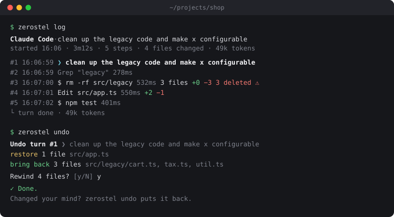

<div align="center">

<picture>
  <source media="(prefers-color-scheme: dark)" srcset="docs/assets/brand/zerostel-logo-dark.svg">
  
</picture>

**任何 agent 出错，都能回到零点。**

给 AI agent 的零信任：假设它一定会出错，记下每一步，把它动过的文件回退回去。
AI 编程 agent 的行车记录仪加时光机，附带你自己定的防护规则，以及能验证是否被篡改的记录。

[官网](https://zerostel.com) · [English](README.md) · [繁體中文](README.zh-TW.md) · [简体中文](README.zh-CN.md) · [日本語](README.ja.md)

[](https://www.npmjs.com/package/zerostel)
[](https://github.com/zerostel/zerostel/actions/workflows/ci.yml)


</div>

```bash
npx zerostel install
```

想先看看效果？`npx zerostel demo` 会创建一个用完即丢的示范项目，模拟 agent 删掉文件夹、把测试搞坏的一轮操作，让你亲手 undo。不需要 agent，也不会碰到你的任何项目。

装好之后照常使用 agent。它把东西搞坏的时候：

```bash
zerostel log          # 一步一步看它做了什么
zerostel undo         # 把文件恢复到 agent 上一轮开始之前
zerostel rewind 0     # 或者一路回到零点：这个 session 开始的时候
zerostel ui           # 同样的事，在本地网页上点着操作
```

<p align="center"></p>

## 为什么需要

agent 会一次改几十个文件，也会运行 `rm`、`git checkout .`、数据库迁移和构建脚本。出问题的时候，你只想知道两件事：它到底做了什么？怎么回去？

有些 agent 自带 checkpoint，但做法差别很大。Claude Code 的 rewind 不包含通过 Bash 造成的改动；Copilot CLI 会跟踪 shell 命令；Cursor 和 Codex 又各有自己的机制。同时用好几个 agent 的话，“改了什么、能不能恢复”每个的答案都不一样。

Zerostel 用同一种方式记录每个支持的 agent：在每个可能改文件的工具调用前后给项目拍快照，留下提示、命令、文件、时间和 token 的时间线，还能导出给别人看的报告。它完全不碰你的 `.git`。

| | agent 自带的 checkpoint | commit／`git stash` | **Zerostel** |
|---|---|---|---|
| shell 命令造成的改动 | 看 agent | 只有你 commit 过的 | ✅ 项目内，加上你指定的文件 |
| 回到指定的某一步 | 通常以提示为单位 | 以 commit 为单位 | ✅ 每次工具调用 |
| 命令、文件、token、时间的时间线 | 部分 | ❌ | ✅ |
| 事后能验证记录是否被改过 | ❌ | ✅（commit 哈希） | ✅ |
| 自定义规则：工具运行前拦下或先问你 | 各家不同 | ❌ | ✅ 所有 agent 用同一套规则 |
| 不同 agent 行为一致 | ❌ 各做各的 | ✅ | ✅ |
| 会写入你的 `.git` | 有些会 | ✅ | ❌ 绝不 |
| 可分享的工作报告 | ❌ | ❌ | ✅ |

详细对比和来源：[docs/comparison.md](docs/comparison.md)。

## 零信任，实际做了什么

这个名字背后的想法：不要因为 agent 平时很乖就信任它。假设它会出错，看见它做的每件事，并且保留一条回去的路。Zerostel 目前做到：

| 原则 | 在这里的意思 |
|---|---|
| **假设一定会出事** | 每个可能改文件的工具调用前后都拍快照。可以撤销任何一轮、回到任何一步，或回到零点。 |
| **看见一切** | 每个提示、工具调用、命令、文件改动、耗时和 token，每个 session 一条时间线。 |
| **记录可验证** | 每一行记录都用带密钥的哈希和前一行串起来。`zerostel verify` 会指出哪一行被改过、删掉或调换了顺序。 |
| **记录器不归 agent 管** | 入门规则禁止 agent 碰 `~/.zerostel`，agent 要卸载 Zerostel 或修改 hook 设置时会先问你。规则可能被绕过，记录不会：session 中途 hook 被拿掉，下一次 hook 运行就会记下来。 |
| **最小权限，规则你定** | `~/.zerostel/policy.json` 里的防护规则，会在工具运行前拦下，或让 agent 先问你。 |
| **限制损害范围** | 回退覆盖项目、你指定的文件（例如 `~/.zshrc`），以及 Windows 的用户环境变量，而且每次回退本身都能再撤销。回退收不回来的事，会先问你（见入门规则），或列出能撤销它的命令。 |
| **不信任读到的任何东西** | Zerostel 把每个项目都当作有恶意：不运行项目里的程序、不顺着链接跑出项目、过滤终端控制码。 |

做不到的事：它不是沙箱。网络请求、部署、数据库写入都撤不回来；agent 用你的账号运行，你能做的事它也能做。详见[限制](#限制)。

## 安装

```bash
npx zerostel install          # 直接运行，不做全局安装
npm install -g zerostel       # 或者保留 zerostel 命令
```

请在你信任的文件夹（例如主目录）运行 `npx`：在项目文件夹里，npx 会优先使用项目自己提供的同名包。需要 git；用 npm 安装的话还需要 Node 20 以上。没有 Node？每个版本也会附带内置 Node 的单一可执行文件，支持 Windows、macOS、Linux 的 x64 和 arm64：从 [Releases](https://github.com/zerostel/zerostel/releases) 下载后运行 `zerostel install`，它会把自己复制到 `~/.zerostel/bin`。`gh attestation verify <文件> --repo zerostel/zerostel` 可以确认下载的文件是由这个仓库的发布流程构建的。Homebrew 和 Scoop 的包即将推出，模板在 [packaging/](packaging)。

`zerostel install` 会把自己复制到 `~/.zerostel/bin`，即使 npx 缓存被清掉 hooks 也照样能用，然后给找到的每个 agent 加上 hooks。修改前会显示差异，并备份每个被改动的配置文件。

### 插件、扩展和 Skill

各个 agent 自己的插件系统也能安装 Zerostel。它们都附带同一个 `zerostel` Skill，教 agent 怎么读自己的时间线、先预览回退再问你要不要应用，以及不要去动记录器。

| Agent | 在 agent 里运行 | 会加上什么 |
|---|---|---|
| Claude Code | `/plugin marketplace add zerostel/zerostel`，再 `/plugin install zerostel@zerostel` | 记录、防护规则和 Skill |
| Codex | `codex plugin marketplace add zerostel/zerostel`，再从插件列表安装 Zerostel | Skill；记录靠 `zerostel install` |
| Antigravity | `agy plugin install https://github.com/zerostel/zerostel` | Skill；记录靠 `zerostel install` |
| Gemini CLI | `gemini extensions install https://github.com/zerostel/zerostel` | Skill；记录靠 `zerostel install` |
| 其他支持 Skill 的 agent | `npx skills add zerostel/zerostel` | Skill |
| MCP 客户端 | [MCP Registry](https://registry.modelcontextprotocol.io) 里的 `io.github.zerostel/zerostel` | MCP server（见下方） |

在 Claude Code 里，插件和 `zerostel install` 二选一即可；两个都开也不会重复记录。没有任何插件会自己启动 MCP server：由你自己添加，运行它的程序也由你决定（见下方）。

## 支持的 agent 和系统

| Agent | 方式 | 状态 |
|---|---|---|
| Claude Code | hooks | ✅ 已在真实 session 中测试 |
| Codex | hooks（第一次需要用 `/hooks` 批准） | ✅ 已在真实 session 中测试 |
| Cursor | hooks | ✅ CLI 已在真实 session 中测试；CLI 不发提示事件，所以在 CLI 里 undo 一次退一步。Windows 上请从 PowerShell 启动，从 Git Bash 启动时它的 hook 不会运行 |
| Gemini CLI | hooks（只在受信任的文件夹生效） | ✅ 已完整实测¹；适用 Code Assist Standard／Enterprise 和付费 API 密钥，个人账号已在 2026 年 6 月迁到 Antigravity |
| Antigravity（CLI、桌面版、IDE） | hooks | ✅ 已完整实测¹；它不提供提示文字，回合会显示为「New turn」 |
| Copilot CLI | hooks（`~/.copilot/hooks`） | ✅ 已在真实 session 中测试 |
| opencode | 插件 | ✅ 已在真实 session 中测试 |
| DeepSeek Harness | 插件 | 🧪 实验性（dsh 本身还是开发者预览版）；已完整实测¹ |
| 其他任何 agent（Aider、脚本……） | `zerostel run -- <命令>` 监视文件变化 | ✅ 较粗略：没有工具调用、token 和防护规则 |

¹ 在 Windows 上运行真正的 agent，只把模型换成按剧本回应的假模型：一个提示、写文件、运行命令、一个被规则挡下的调用、回合结束，再 undo。

实验性的 agent 要指名才会安装，例如 `zerostel install --agent deepseek`。欢迎反馈真实使用的情况。

Zerostel 不在乎 agent 背后用的是哪个模型：Claude、GPT、Gemini、DeepSeek 或本地模型，记录方式都一样。

支持 Windows、macOS、Linux（含 WSL）。CI 会在三个系统、Node 20／22／24 上测试每一次提交。

## 命令

**记录**

| 命令 | |
|---|---|
| `zerostel install` | 给这台电脑上找到的 agent 加上 hooks。`--agent gemini,copilot` 指定，`--agent all` 装所有非实验性的。 |
| `zerostel run -- <命令>` | 不用 hooks 也能记录任何 agent 或脚本，文件变化稳定后拍快照。 |

**查看**

| 命令 | |
|---|---|
| `zerostel log` | 这个项目最近一次 session 的时间线。`-n 20` 看最后 20 步，`--changes` 只看改了文件的步骤。 |
| `zerostel ui` | 在本地网页查看 session、时间线和 diff，可以直接点击恢复和撤销。 |
| `zerostel sessions` | 这个项目所有录下来的 session。 |
| `zerostel show <n>`／`zerostel diff <n>` | 第 *n* 步的命令、输出和文件，或者完整的 diff。 |
| `zerostel find <路径>` | 所有 session 里动过这个文件的每一步。 |

**回到过去**

| 命令 | |
|---|---|
| `zerostel undo` | 回到 agent 上一个改了文件的回合之前。紧接着再运行一次可以撤销这次 undo。 |
| `zerostel rewind <n>` | 回到第 *n* 步之前（`--after` 是之后，`0` 是零点）。不给 *n* 会列出步骤让你选。`--only <路径>` 只恢复一部分，`--dry-run` 先预览。 |
| `zerostel snapshot -m "说明"` | 手动保存一个检查点。 |

**分享与验证**

| 命令 | |
|---|---|
| `zerostel report --open` | 把 session 导出成一个独立的 HTML 网页。 |
| `zerostel report --share` | 给别人看的版本：文件里不含提示、命令、输出和 diff。 |
| `zerostel verify` | 检查这个 session 的记录在记录之后是否被改过（`--all` 检查全部）。 |

**防护规则**

| 命令 | |
|---|---|
| `zerostel policy init` | 创建入门规则：不准碰凭据；强制推送或修改 `.env` 前先问。 |
| `zerostel policy` | 显示你的规则。 |
| `zerostel policy test "<命令或路径>"` | 看看它会不会碰到哪条规则。 |

**整理**

| 命令 | |
|---|---|
| `zerostel status`／`zerostel doctor` | 安装和记录状态；完整检查，输出可以直接贴到 issue。 |
| `zerostel prune` | 删除 30 天前的 session（`--older-than 7d`）和只有它们用到的快照。 |
| `zerostel projects` | 所有有记录的项目，挪过位置的也能找到；任何命令都能加 `--project <id>`。 |
| `zerostel config` | 显示设置。 |
| `zerostel completion <shell>` | bash、zsh、fish、PowerShell 的 Tab 自动补全，例如 `eval "$(zerostel completion bash)"`。 |
| `zerostel uninstall` | 移除 hooks。记录会留在 `~/.zerostel`，直到你自己删除。 |

`--session <id>` 选择较早的 session，`--json` 输出机器可读格式，`-y` 跳过确认。

## 防护规则

规则放在 `~/.zerostel/policy.json`。没有这个文件就没有规则。`zerostel policy init` 会创建一份入门规则：除了下面这些，还会在以管理员身份运行（`sudo`）、全局安装或卸载软件（`npm -g`、`pip --user`、`brew`、`winget`……）、修改系统或用户设置（`setx`、`reg`、`crontab`……）、写入系统文件夹、发布或部署（`npm publish`、`terraform apply`、`vercel --prod`……）、删除数据表，以及关闭 Zerostel 本身（`zerostel uninstall`、`zerostel prune`、修改 agent 的 hook 设置）之前先问你。规则比对的是命令的写法，能拖慢 agent 但挡不死；就算 hook 还是被拿掉，记录里也会留下来。节选：

```json
{
  "rules": [
    { "action": "deny", "paths": ["~/.ssh/**", "~/.aws/**", "~/.gnupg/**", "~/.kube/**", "~/.config/gcloud/**", "~/.zerostel/**"],
      "reason": "credentials, and Zerostel's own records, are off limits" },
    { "action": "ask", "paths": ["**/.env", "**/.env.*"], "access": "write", "reason": "changes a .env file" },
    { "action": "ask", "commands": ["git push --force*", "git push -f*", "git reset --hard*", "git clean -*f*", "* --no-verify*"],
      "reason": "rewrites or throws away git history" }
  ]
}
```

`zerostel policy init` 生成的文件带有 `$schema`，VS Code 等编辑器会边输入边补全、检查（schema 在 `https://zerostel.com/schema/policy.json`，`config.json` 也有）。

- **`paths`** 匹配工具调用用到的文件，包括 shell 命令里出现的路径。`~/` 是你的主目录，其他相对路径从项目根目录算起。`**` 可以跨文件夹，`*` 不行。`"access": "write"` 让规则只作用于会改文件的工具。
- **`commands`** 匹配 shell 命令的每一段（用 `&&`、`||`、`;`、`|` 切开）。`*` 代表任意内容。
- **`tools`** 匹配工具名称，例如 `"WebFetch"` 或 `"mcp__github__delete_*"`。
- **`deny`** 在运行前拦下，并告诉 agent 原因。**`ask`** 会让 Claude Code 先问你；没法暂停询问的 agent 会拦下，并让 agent 先跟你确认。

命令匹配不区分大小写，并在 `&&`、`||`、`;`、`|`、`&`、`( )`、`$( )` 和反引号处切开；`$HOME/.ssh`、`%USERPROFILE%\.ssh`、Git Bash 的 `/c/Users/...` 这类写法都能认出来。

被拦下和被询问的调用会出现在时间线、网页界面和报告里。`policy.json` 写坏时，`zerostel status` 和 `doctor` 会指出来，不会自行猜测；Zerostel 自己出问题时，也绝不会拦住工具。防护规则是防止失误的安全带，不是沙箱：一条命令可以不写出文件名就碰到那个文件。

更多现成规则（机密、上传、数据库迁移、主分支、MCP 工具、依赖包、CI 专用的严格版），每条都有测试：[docs/guardrails.md](docs/guardrails.md)。

## 在 CI 里使用

在 GitHub Actions 里无人值守运行的 agent，也能有同样的记录、防护规则和报告。时间线会写进 job summary，报告会附在这次运行上：

```yaml
- uses: zerostel/zerostel@v0
  with:
    agent: claude-code
    policy: .github/zerostel-policy.json
    run: claude -p "make npm test pass" --permission-mode acceptEdits
```

详见 [docs/ci.md](docs/ci.md)。

## 让 agent 自己使用（MCP）

`zerostel mcp` 是一个 [Model Context Protocol](https://modelcontextprotocol.io) server，agent 自己就能在做危险操作前存检查点、看时间线、用你的规则先检查命令，也能在你要求时回退（“回到第 12 步”、“回到零点”）。回退在明确要求应用之前只会预览，而且只作用于 agent 启动时所在的项目。

全局安装 `zerostel`（`npm install -g zerostel`）后，添加到 Claude Code：

```bash
claude mcp add zerostel -- zerostel mcp
```

Windows 上改用 `claude mcp add zerostel -- cmd /c zerostel mcp`。Codex 从 `~/.codex/config.toml` 读取：

```toml
[mcp_servers.zerostel]
command = "zerostel"
args = ["mcp"]
```

其他 agent 在它们的 MCP 设置里填入同样的命令和参数即可。

## 工作原理

```
 agent ──hook──▶ zerostel ──▶ policy.json      工具运行前拦下或先问
 （每次工具调用      │
  前后各一次）       └──────▶ ~/.zerostel/projects/<名称>-<hash>/
                              ├─ snapshots.git      影子仓库，工作目录就是你的项目
                              └─ sessions/*.jsonl   提示、命令、文件、token、时间（哈希串链）
```

- **Hooks。** agent 在每次工具调用前后、每一轮开始和结束时通知 Zerostel。只读工具只做记录；可能改文件的工具前后各拍一次快照。
- **影子 git 仓库。** 快照存在独立的仓库里，它的工作目录就是你的项目。你的 `.git`、分支、index、stash 都不会被改动，项目也不必是 git 仓库。文件逐字节保存，相同内容只存一份。
- **快照范围。** `.gitignore` 没排除的都会保存，`node_modules` 这类依赖文件夹除外。`.env` 这种被忽略的小文件仍然会备份，因为 agent 删掉它的时候，正是你最需要它的时候。`watch` 里列出的项目外文件，存在另一个独立的仓库里。
- **安全的恢复。** 恢复前会先拍下当前状态，所以每次恢复都能撤销。只删除那份快照有备份的文件，不会顺着 symlink 或 junction 跑出项目，恢复后还会检查结果。
- **可验证的记录。** 每一行事件都带有“前一行加上自己”的 HMAC，密钥是 `~/.zerostel/audit.key`。
- **不碍事。** 除非规则触发，hooks 不输出任何内容、总是以 0 退出、错误写进自己的日志。Zerostel 出问题时，agent 照常工作。

详见 [docs/architecture.md](docs/architecture.md)。

## 配置

`~/.zerostel/config.json`（每个字段都可省略）：

```json
{
  "maxFileMB": 25,
  "snapshotTimeoutSec": 20,
  "retentionDays": 30,
  "exclude": ["data/**", "*.sqlite"],
  "watch": ["~/.zshrc", "~/.bashrc", "~/.gitconfig"]
}
```

- **`maxFileMB`**：超过这个大小的新文件不拍快照，时间线会注明。
- **`snapshotTimeoutSec`**：单次快照超过这个时间，这个项目暂停快照一小时，时间线照常记录。
- **`exclude`**：永远不拍快照的 git pathspec glob。
- **`watch`**：主目录下要跟着每个项目一起拍快照、一起回退的文件（每个最大 1 MB）。这些文件有变化时，会在时间线上单独显示为一步。

## 隐私与安全

所有数据都留在你的电脑上，不会上传。`~/.zerostel` 只有你自己能读。

时间线会保存提示、命令和命令输出的最后一段。API key、token 和密码会尽量遮蔽，但格式特殊的密钥不保证能遮住。文件内容只存在快照仓库里。报告不会包含 `.env` 这类文件，`--share` 则完全不含提示、命令、输出和 diff，但文件路径和时间仍然保留。

Zerostel 把项目视为不可信：文件名不会变成 git 选项或匹配模式、链接不会让快照或恢复跑出项目、项目文件夹里的程序不会被当成 git 或 shell 运行、输出里的终端控制码会被过滤。`zerostel ui` 只监听 127.0.0.1，而且需要它打印的链接里的随机 token。[docs/security-model.md](docs/security-model.md)（英文）说明 Zerostel 保护什么、不保护什么；发现问题请看 [SECURITY.md](SECURITY.md)。

## 名字的由来

**Zero** trust（零信任）＋ **Stella**（星辰）。AI agent 像夜空里的星星一样越来越多；Zerostel 是它们最终都会回到的那一点：一份能验证的记录，和一条回到零点的路。

## 常见问题

**会拖慢 agent 多少？** 用 `scripts/bench.mjs` 在 Windows 11（笔记本 i9，启动新进程最慢的平台）上测的：

| | 1,000 个文件 | 10,000 个文件 | 50,000 个文件 |
|---|---|---|---|
| 只读取的工具调用 | 0.16 秒 | 0.16 秒 | 0.16 秒 |
| 会改文件的工具调用（前后各拍一次快照） | 1.0 秒 | 1.2 秒 | 1.9 秒 |
| 项目的第一次快照（在后台进行） | 3 秒 | 35 秒 | 5 分钟 |

第一次快照要把每个文件读一遍。它在 session 开始时就在后台进行，agent 不用等；完成之前的步骤照样记录，只是没有快照。快照大约占项目压缩后的大小，再加上变动的部分。运行 `npm run build && node scripts/bench.mjs` 可以测你自己的电脑。

**git 不就够了？** 如果你在合适的时间点 commit 或 stash，git 是很好的恢复工具。但 agent 在 commit 之间就会改东西，而且常常通过 shell 命令，没人会在每次工具调用前 commit。Zerostel 自动做这件事，而且存在自己的仓库里，不弄乱你的历史。长期保存还是交给 git 和正常备份。

**那 jj 呢？** Jujutsu 每次运行 `jj` 命令都会快照工作目录，也有可以 undo 的操作日志。如果你的 agent 会在合适的时间点运行 jj，它能覆盖大部分需求。Zerostel 多了逐步时间线、防护规则和报告，而且不需要任何人去运行什么。

**这不是应该内置在 agent 里吗？** 不少 agent 有 checkpoint 和权限规则，够用的话就用它。Zerostel 适合想要一份记录、一套规则、一种恢复方式覆盖所有 agent 的人。两者不冲突。

**和 snap-back 或 Entire 有什么不同？** snap-back 也用影子 git 拍快照并提供 undo；Entire 把 agent session 和你的 commit 关联起来。Zerostel 把快照对应到 agent 的每一步，再加上时间线、防护规则、可验证的记录、网页界面和可分享的报告。

**它是沙箱吗？** 不是。防护规则拦下你规则里写到的工具调用，回退把文件放回去。要运行不信任的代码，请另外把 agent 放进容器或独立账号。

**undo 会把 agent 做的事全部撤回吗？** 不会。它只把拍到的文件放回去：项目，以及你在 `watch` 列出的文件。命令全局安装或卸载的包（npm、pip、Homebrew）会显示为一步，并附上撤销用的命令；回退时 Zerostel 会列出来，但绝不替你运行。Windows 上用 `setx` 等方式改的用户环境变量会被恢复。网络请求、部署、数据库写入、你真正的 `.git` 都不会被撤回，agent 的对话也不会倒退，那部分请在 agent 里另外 rewind，或者开新 session。

**能只撤销一个 agent，让另一个继续工作吗？** 不安全。undo 会恢复整个项目（或 `--only` 指定的路径），期间其他 agent 或你自己的修改也会一起被恢复。先用 `--dry-run` 预览；同时运行的 agent 请用不同的 worktree。

**会占多少磁盘？** 相同内容只存一份并压缩。`zerostel status` 会显示总量，`zerostel prune` 可以清理旧的 session。

**token 数字就是我的账单吗？** 不是。它从 agent 的对话记录读取，格式不认识时会显示 not captured，`zerostel run` 则完全看不到 token。请以服务商的后台为准。

## 限制

- 只能恢复拍到过的状态。删除发生之后才开始记录，就找不回那个文件。
- 一个 shell 命令内部没有中间状态：同一条命令里创建又删除的文件不会被看到。`zerostel run` 在文件稳定后才拍快照，短暂存在的文件也可能漏掉。
- 项目外只有你在 `watch` 列出、而且位于主目录下的文件会拍快照。Windows 的用户环境变量（`HKCU\Environment`）只在会改它的命令前后读取，回退时恢复；它们的值存在你电脑上的 session 记录里，不会出现在报告中。全局包只会列出，并附上撤销命令。回退时，目标时间点还不存在的监视文件会保持原样。项目外的其他内容都不覆盖，但时间线仍会显示动过它的命令。
- 以下内容不拍快照，存在时 `zerostel log` 会列出：被忽略的文件夹（`node_modules`、`dist/`、`.gitignore` 里的内容）、嵌套的 git 仓库和 submodule、链接文件夹（symlink、junction）、超过 `maxFileMB` 的新文件。
- 在用户主目录或磁盘根目录启动的 agent 只有时间线，没有快照。
- 不区分大小写的文件系统（Windows、macOS 默认）上，只改大小写的重命名（例如 `readme.md` → `README.md`）不会被当作改动。
- 在 WSL 里，放在 Windows 磁盘（`/mnt/c/...`）上的项目拍快照很慢，请放在 Linux 文件系统里。
- 哈希串链能看出记录被“没有你的 `audit.key` 的东西”改过。用你自己账号的人可以读到密钥并整份重写记录；请把 `~/.zerostel/**` 放在 deny 规则里，让 agent 碰不到。
- 防护规则匹配的是工具调用写出来的内容。不写文件名就能碰到文件的脚本或命令，会穿过去。

## 开发方向

- **已完成：** 七个 agent 的记录与回退、零点、网页界面、可分享的报告、可验证的记录、防护规则、MCP server、监视项目外的文件。
- **接下来：** 不需要你的密钥也能验证的签名报告；通过 Zerostel 网关记录其他 MCP server 的调用；解析测试输出，指出是哪个测试坏了；实验性 agent 的真机验证。

## 疑难排解

运行 `zerostel doctor`。它会检查 Node、git、每个 agent 的 hooks 和版本、配置文件、快照覆盖范围、最近一次 session 的审计链、防护规则和最近的 hook 错误，输出可以直接贴到 issue（主目录路径会缩写成 `~`）。

## 参与开发

问题和想法欢迎到 [Discussions](https://github.com/zerostel/zerostel/discussions) 讨论。支持新的 agent 只需要在 [src/agents/adapters.ts](src/agents/adapters.ts) 加一个 adapter。请看 [CONTRIBUTING.md](CONTRIBUTING.md) 和 [docs/architecture.md](docs/architecture.md)。

```bash
npm ci && npm test && npm run smoke
```

## 许可证

[Apache-2.0](LICENSE)
