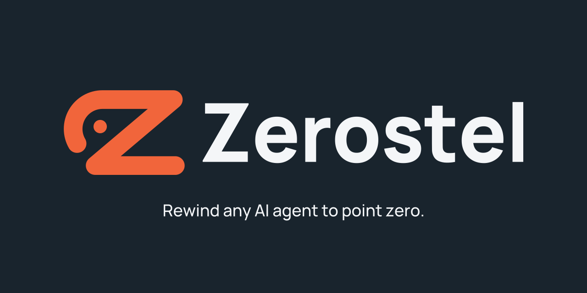

# Zerostel 品牌素材 v2

正式素材以 SVG 為主檔。設計保留 Z、左上回彎與起點圓點，表達「走出去，仍能回到起點」。圖形與 **Zerostel** 字標皆為封閉路徑，不依賴安裝字型或外部圖片。

## 固定色票

| 用途 | HEX |
| --- | --- |
| 品牌橘色 | `#F1653B` |
| 深炭色字標與分享圖背景 | `#19242D` |
| 深色背景使用的淺色字標 | `#F4F6F8` |

所有正式素材使用相同色票，不加入漸層、陰影或立體效果。

## 向量主檔

| 檔案 | 規格 | 用途 |
| --- | --- | --- |
| [zerostel-logo-light.svg](./zerostel-logo-light.svg) | 1457 × 334，透明背景 | 淺色背景的橫式標誌，深炭色字 |
| [zerostel-logo-dark.svg](./zerostel-logo-dark.svg) | 1457 × 334，透明背景 | 深色背景的橫式標誌，淺色字 |
| [zerostel-icon.svg](./zerostel-icon.svg) | 420 × 420，1:1，透明背景 | 組織頭像、一般介面與報告圖示 |
| [zerostel-icon-small.svg](./zerostel-icon-small.svg) | 420 × 420，1:1，透明背景 | 16–32px 的分頁與小圖示 |

淺色版、深色版、一般方形圖示與分享圖使用同一組標準 Z 和圓點路徑。淺色與深色橫式版本只切換字標顏色。

回彎末端與主筆畫使用一致的圓頭。圓點位置經過小尺寸調整，一般圖示在 32px 時仍可與主體分離。16–32px 的專用簡化版省略圓點和回彎，並加厚 Z 的筆畫。

## 圖示 PNG

所有 PNG 直接由對應 SVG 匯出，背景透明。

| 尺寸 | 檔案 | 使用的主檔 |
| --- | --- | --- |
| 512 × 512 | [zerostel-icon-512.png](./zerostel-icon-512.png) | 一般圖示 |
| 256 × 256 | [zerostel-icon-256.png](./zerostel-icon-256.png) | 一般圖示 |
| 128 × 128 | [zerostel-icon-128.png](./zerostel-icon-128.png) | 一般圖示 |
| 64 × 64 | [zerostel-icon-64.png](./zerostel-icon-64.png) | 一般圖示 |
| 32 × 32 | [zerostel-icon-32.png](./zerostel-icon-32.png) | 小尺寸簡化版 |
| 16 × 16 | [zerostel-icon-16.png](./zerostel-icon-16.png) | 小尺寸簡化版 |

組織頭像使用 512px 版本。分頁圖示與 16–32px 的介面圖示使用簡化版。

## 分享預覽圖

- [social-preview.png](./social-preview.png)：1280 × 640，38,127 bytes，約 38KB。
- [social-preview.svg](./social-preview.svg)：對應向量主檔，標語也已轉成路徑。
- 標語：**Rewind any AI agent to point zero.**
- 背景為深炭色，搭配橘色圖形與淺色字標。
- 重要內容位於中央 1200 × 600 安全範圍內，即 x = 40–1240、y = 20–620。

## 留白與縮放

橫式 SVG 四周留白約一個起點圓點直徑。主檔中圓點直徑為 40 單位，四周留白約 40 單位，縮放時保持相同比例。外部排版應保留這段空間，避免文字或其他元素貼近標誌。

維持原始寬高比，不拉伸、旋轉或更換單一檔案中的顏色。小尺寸使用專用簡化圖示，避免縮小整組含字標的橫式標誌。

## 規格確認

- 橫式 SVG 每份約 4.5KB，一般圖示 479 bytes，小尺寸圖示 378 bytes。
- SVG 僅包含路徑與分組，不包含點陣圖片、字型連結、腳本或外部資源。
- 已檢查淺色與深色版本的圖形和字標路徑一致。
- 已檢查實際 32px 一般圖示的圓點與主體沒有黏合，以及 16px、32px 簡化版的連續性。
- 已確認 PNG 尺寸、透明背景、固定橘色色票，以及分享圖的安全範圍與檔案大小。

